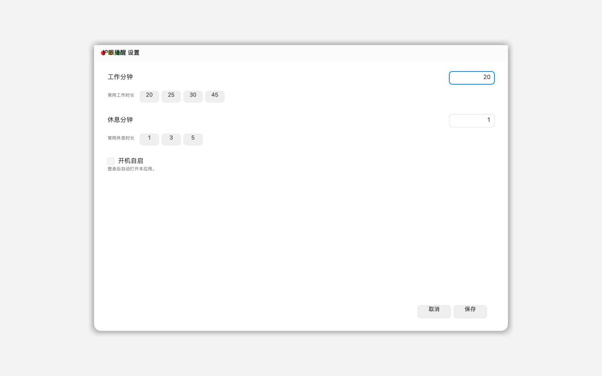

# 护眼提醒

一个轻量的 macOS 护眼休息提醒工具。支持固定工作时长 / 休息时长、休息浮窗、延后 5 分钟、跳过本次休息、离开电脑自动暂停，以及 `Esc` 直接跳过当前休息。



## 下载

如果你不想看 GitHub 源码页，直接下载发布版即可：

- [EyeBreaker.zip](https://github.com/yadongz097-create/eye-breaker/releases/download/v1.0.0/EyeBreaker.zip)

下载后解压，把 `护眼提醒.app` 拖到 `Applications`，再双击打开。

## 功能

- 定时提醒休息
- 全屏休息浮窗
- `Esc` 跳过本次休息
- 延后 5 分钟
- 键鼠长时间不动或锁屏时自动暂停
- 开机自启

## 更新说明

- 点击“保存”后，会立刻按新的工作/休息时长重置当前计时
- 点击窗口右上角 `X` 或“取消”，都会直接关闭，不保存修改
- 只有点“保存”才会提交修改并重置当前计时

## 使用

1. 打开应用后，在设置里调整工作分钟和休息分钟。
2. 点“保存”后开始计时。
3. 到休息时间后，会弹出全屏休息窗口。
4. 需要跳过时，按 `Esc` 或点“跳过本次休息”。
5. 如果你只想先看设置内容，直接关闭窗口也会自动保存。

更详细的中文说明见 [docs/usage.md](docs/usage.md)。

## 构建

```bash
swift build -c release
./scripts/package-app.sh release
```

打包后的应用在：

```bash
dist/护眼提醒.app
```

## 目录

- `Sources/`：应用源码
- `scripts/`：打包和图标生成脚本
- `dist/`：发布产物
- `docs/assets/`：README 预览图

## 许可证

MIT
